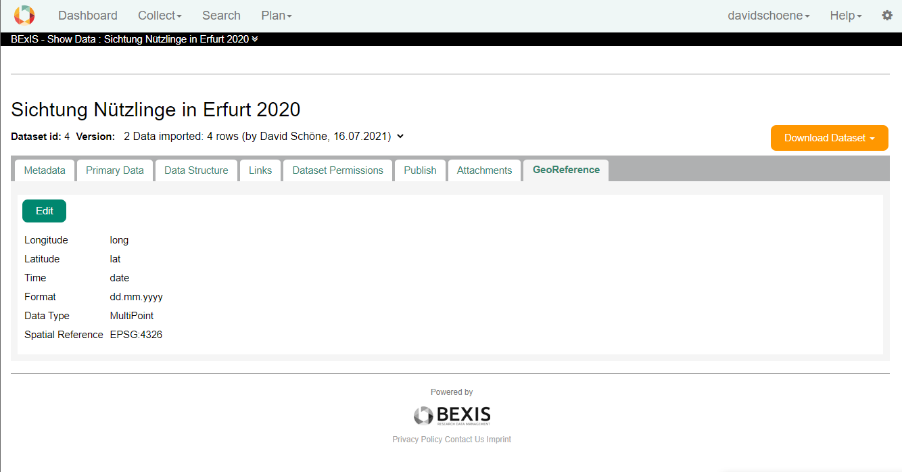
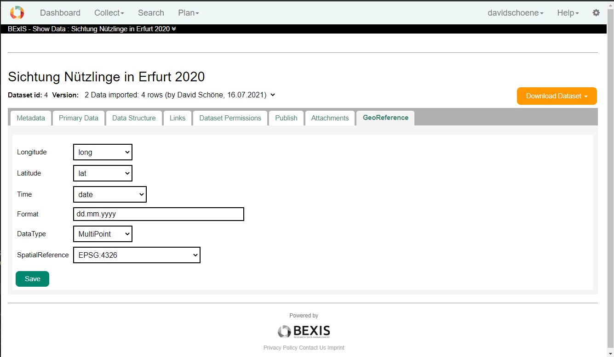
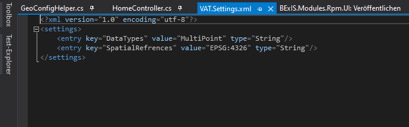

[](http://BExIS2.uni-jena.de/) 
# Module VAT - Geoengine - The Visualization, Analysis and Transformation System


> This BEXIS 2 module extends the system with an interface to the [Geoengine](https://www.geoengine.de/). 

## About Geoengine

Integrating geodata into analyses and processes is a major challenge. They are difficult to obtain, are available in a variety of formats and require a lot of storage space. They are therefore the epitome of Big Data.

The Geo Engine is a cloud-based analysis platform that overcomes the limitations of existing solutions on the market. It connects data sources in such a way that data scientists can process them interactively over time intervals and analyse them visually. The results can be integrated into machine learning frameworks and business processes via our interfaces or presented to decision-makers as an interactive app.

[https://www.geoengine.de/](https://www.geoengine.de/)


## What does this module do.

>This module extends BEXIS2 to provide the necessary information for geoengine to retrieve data.

- Both the UI and the API's are extended.
- User can create and save a configuration file per dataset for geoengine. 
- Furthermore, the APIs are extended by two additional APIs.

### geoengine requirements

In order for geoengine to be able to understand which information about a dataset is geo reference information, a JSON per dataset must be provided by BEXIS 2.

**full JSON-EXAMPLE**

```json
{
 "definition": {
         "metaData": {
                 "OgrMetaData": {
                         "loadingInfo": {
                                 "columns": {
                                         "float": [],
                                         "int": [],
                                         "text": [
                                                 "Region",
                                                 "Province",
                                                 "Longitude",
                                                 "SourceID",
                                                 "HydroBasin",
                                                 "field_13",
                                                 "Date",
                                                 "SiteID",
                                                 "Waterbody",
                                                 "Country",
                                                 "Protocol",
                                                 "Latitude",
                                                 "BioRealm"
                                         ],
                                         "x": "Longitude",
                                         "y": "Latitude"
                                 },
                                 "dataType": "MultiPoint",
                                 "fileName": "RivFishTIME_TimeseriesTable_mit_dates.csv",
                                 "forceOgrTimeFilter": false,
                                 "layerName": "RivFishTIME_TimeseriesTable_mit_dates",
                                 "onError": "ignore",
                                 "time": {
                                         "start": {
                                                 "duration": 800000,
                                                 "startField": "Date",
                                                 "startFormat": {
                                                         "customFormat": "%d.%m.%Y",
                                                         "format": "custom"
                                                 }
                                         }
                                 }
                         },
                         "resultDescriptor": {
                                 "columns": {
                                         "BioRealm": "text",
                                         "Country": "text",
                                         "Date": "text",
                                         "field_13": "text",
                                         "HydroBasin": "text",
                                         "Latitude": "text",
                                         "Longitude": "text",
                                         "Protocol": "text",
                                         "Province": "text",
                                         "Region": "text",
                                         "SiteID": "text",
                                         "SourceID": "text",
                                         "Waterbody": "text"
                                 },
                                 "dataType": "MultiPoint",
                                 "spatialReference": "EPSG:4326"
                         }
                 }
         },
         "properties": {
                 "description": "asdas",
                 "name": "asdasdasdasdasd",
                 "sourceOperator": "OgrSource"
         }
 },
 "upload": "c94db216-f32f-414a-932d-de4ae97ed6d3"
}
```
Only the loadingInfos must be filled and retrievable.


API´S must also be provided so that the information can be loaded. -> [go to apis](#apis)

### UI

The details view of a dataset will be extended by another tab. This tab can only be reached if you have read rights to the dataset or the dataset is public.



if you have edit rights, you can customise the geo ref information for a dataset record.

### Preparing the data in BEXIS2 for Geoengine ###
The required values in geoengine.json are partly provided automatically by BEXIS2. However, a small part of the information must still be entered by the user so that the system can understand what the important columns for X,Y and time are.

**User**
The users who have write access to datasets have the possibility to edit the geoengine.json. This is possible in the UI at Show Dataset. A form is loaded. The variables are available for selection as dropdowns.

The user must define the following variables.

- Longitude
- Latitude
- Time
- Format
- DataType
- Spatial Reference

**Set Geo-Reference to Dataset**
If you have edit rights on a dataset and the VAT module is activated, an additional tab appears on the dataset overview page. The tab shows the selected attributes and a button to edit them.

Not all data shown in the geoengine.json has to be selected by the user. Most of the information is set by the system.



When selecting the time, the system checks in the background whether the selected column is a DateTime. If it is, the system checks whether a display format exists and then automatically inserts it into the next row Format.

**System**
The module has a settings file in which the selection of the DataType & - Spatial Reference can be defined.



The following information is read out from the system without the user having to make any entries.

- list of all variables
- membership of data types
- filename
- set x & y

## APIS

Furthermore, the APIs are extended by two additional APIs.

Geoengine (VAT) needs 3 apis to get the data from BEXIS 2.

**call examples**

```
// list all georeferenced datasets
https://train.bexis2.uni-jena.de/api/georef

// get geo-reference information about the dataset
https://train.bexis2.uni-jena.de/api/georef/4

// get data as csv from the dataset
https://train.bexis2.uni-jena.de/api/data/4

```

## Registration as data provider in GeoEngine

An administrator of geoengine creates a file with all information about a BEXIS 2 instance.

please contact: info@geoengine.de

